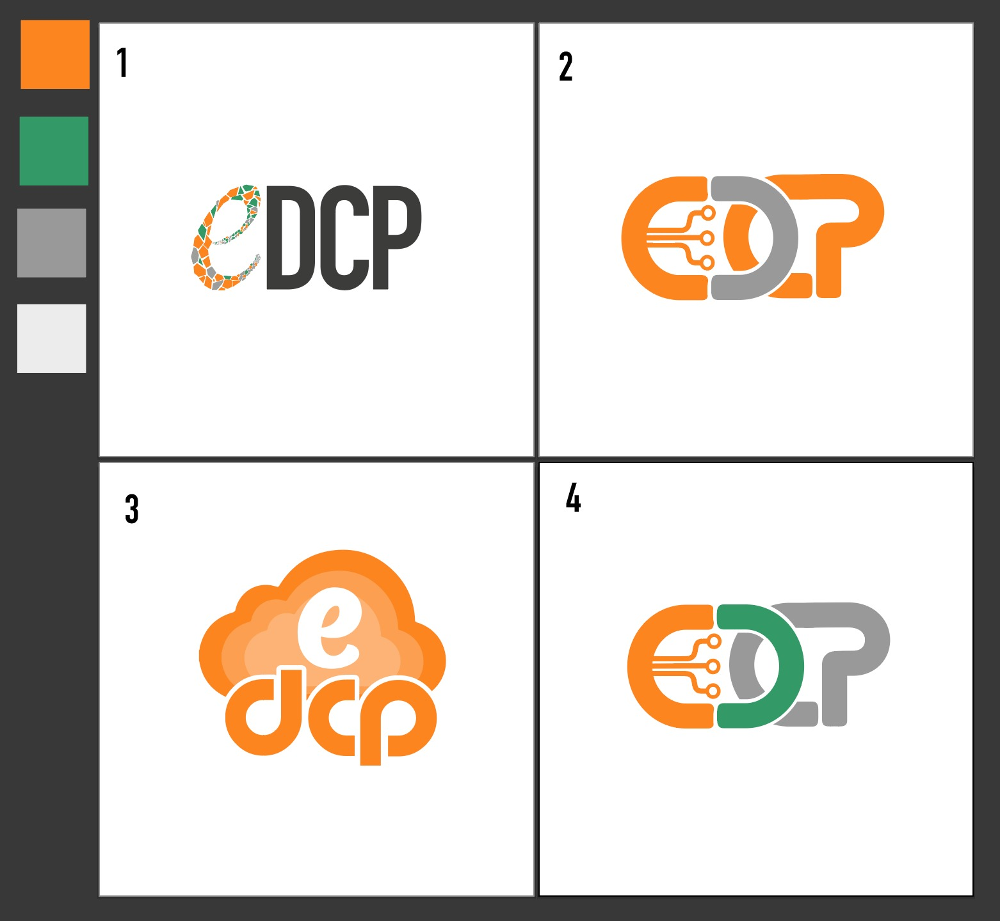
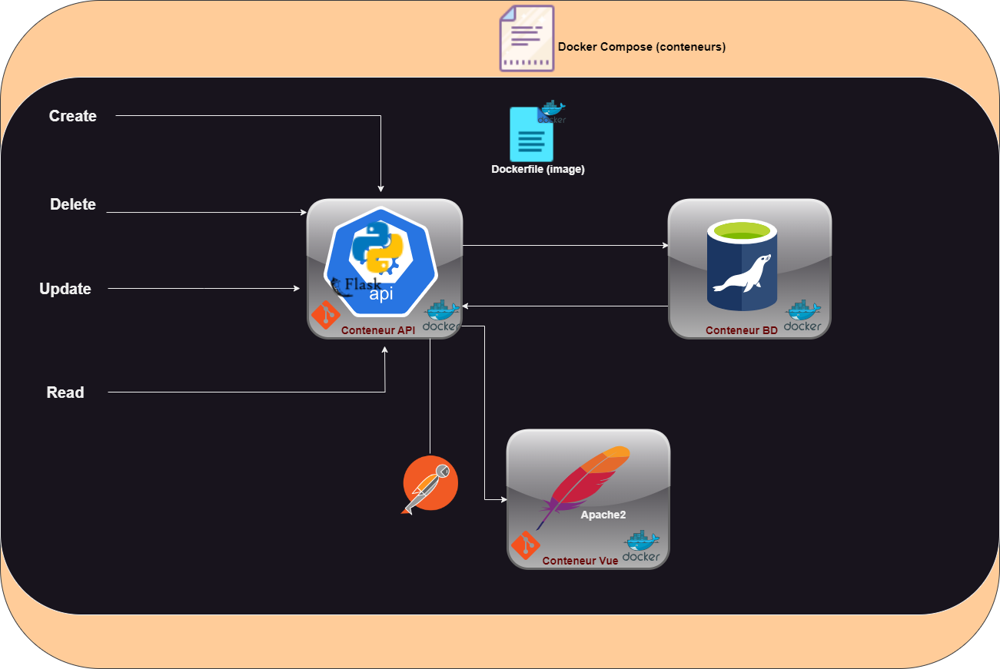

# **E-DCP API REST V0 actuelle**

**


Le projet **e-DCP** a été lancé en vue de digitaliser les services de l’Autorité de protection et de faciliter ainsi les démarches des entreprises et le suivi de la conformité. A cet effet, une équipe projet a été créée.
Cette application est architecturée en **3 tiers** .


## l'architecture se présente comme suit:

<p align="center">
  
</p>

## Les référence de l'API REST

### **Créer une méthode**

**`POST`**		/edcp/api/v0/users		**`Create an user`**

### **Codes de reponse**

#### **Success**
Code | Reason
---- | ------
`201 - Created` | La demande a abouti et des ressources ont été crées.

#### **Error**
Code | Reason
---- | ------
`400 - Bad Request` | Certains contenus de la demande n'étaient pas valides..
`401 - Unauthorized`| L'utilisateur doit s'authentifier avant de faire une demande.
`403 - Forbidden` |	La stratégie n'autorise pas l'utilisateur actuel à effectuer cette opération.
`409 - Conflict` | Cette opération est entrée en conflit avec une autre opération sur cette ressource.

#### **Request parameters**

Name |  In  | Type | Description
---- | ---- | ---- | -----------
courrier électronique | body | string | L'adresse e-mail de l'utilisateur.
mot de passe | body | string | Le mot de passe de l'utilisateur.
nom de famille | body | string | Le nom de famille de l'utilisateur.
prénom | body | string | Le prénom de l'utilisateur.
Numéro de téléphone | body | string | Le numéro de téléphone de l'utilisateur.
connexion | body | string | Le login de l'utilisateur.
ville | body | string | La ville de l'utilisateur.
Organisation | body | string | L'organisation de l'utilisateur.
fonction | body | string | La fonction de l'utilisateur.
consentement | body | string | Le consentement de l'utilisateur.
date de création | body | date | La date de création de l'utilisateur.
ID_rôle | body | string | L’identifiant de rôle de l’utilisateur.
Type de contenu | header  | string | Définit le type MIME de la requête, définissez cet header  sur application/json.
Autorisation (Facultatif) | header  | string | Jeton d'authentification. Si vous omettez cet header , votre demande échoue.

#### **Response de la création de l'utilisateur**

```
Json

Body:
    {
        "message": "Utilisateur créé avec succès",
        "status_code": 201
    }
```

## **List method**

**`GET`**		/v1/rest/users			**`List users`**

### **Response codes**

#### **Success**
Code | Reason
---- | ------
`200 - Ok` | La demande a réussi.
`206 - Partial Content` | La demande a abouti mais avec un contenu partiel.

#### **Error**
Code | Reason
---- | ------
`400 - Bad Request` | Certains contenus de la demande n'étaient pas valides.
`401 - Unauthorized`| L'utilisateur doit s'authentifier avant de faire une demande.
`403 - Forbidden` |	La politique n'autorise pas le produit actuel à effectuer cette opération.

#### **Request parameters**


## Badges

[](https://choosealicense.com/licenses/mit/)
[](https://opensource.org/licenses/)
[](http://www.gnu.org/licenses/agpl-3.0)


## Authors

  **ARTCI** : `https://artci.ci/`

  **DPDP** : `https://www.autoritedeprotection.ci/`
